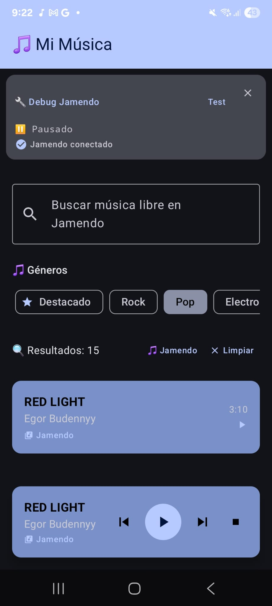
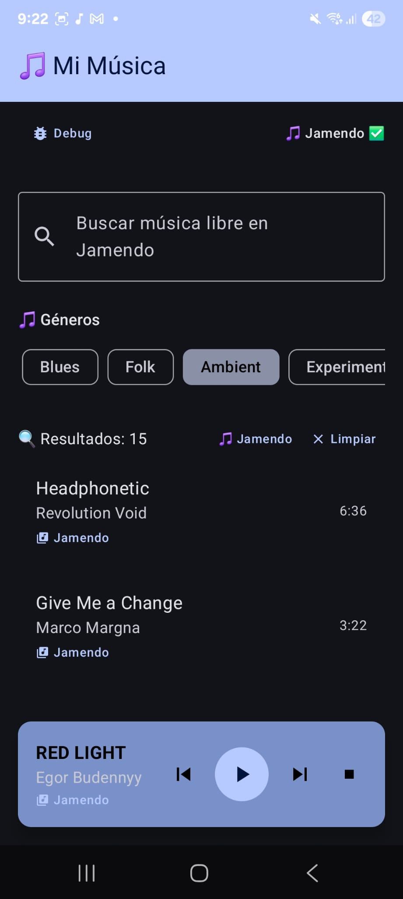

# 🎵 Reproductor Multimedia Android

[](https://android.com/)
[](https://kotlinlang.org/)
[](LICENSE)

## 📖 Descripción

Un reproductor multimedia moderno y personalizable para Android, diseñado como una alternativa independiente a los servicios de streaming comerciales. Este proyecto forma parte de mi portafolio de desarrollo móvil y representa mi visión de cómo debería ser una experiencia musical verdaderamente personalizada.

**Motivación**: Inspirado por la necesidad de tener un control total sobre la experiencia musical personal, sin las limitaciones y restricciones de las plataformas de streaming tradicionales como Spotify. Este reproductor está diseñado para integrarse con un servidor multimedia casero, ofreciendo una solución completa y autónoma para la gestión y reproducción de música.

## ✨ Características Principales

- 🎶 **Reproducción Local y Remota**: Compatible con archivos locales y streaming desde servidor personal
- 🎨 **Interfaz Moderna**: Diseño Material Design 3 con tema claro/oscuro
- 📱 **Gestión Avanzada**: Creación y administración de playlists personalizadas
- 🔄 **Modos de Reproducción**: Reproducción normal, aleatoria, repetición por canción/playlist
- 🔔 **Control en Segundo Plano**: Notificaciones interactivas y widget de pantalla de inicio
- 🌐 **Integración con Servidor Personal**: Próxima conexión con servidor multimedia casero
- 🎵 **Soporte Multi-formato**: MP3, FLAC, OGG, WAV y más formatos de audio
- 📊 **Visualizador de Audio**: Efectos visuales durante la reproducción

## 🛠️ Tecnologías Utilizadas

### Desarrollo Android
- **Kotlin 100%** - Lenguaje principal de desarrollo moderno y conciso
- **Android SDK** - Framework de desarrollo móvil nativo
- **Gradle** - Sistema de construcción y gestión de dependencias

### Arquitectura y Componentes Android
- **Activities & Fragments** - Componentes de interfaz de usuario
- **Services** - Reproducción en segundo plano
- **MediaPlayer API** - Motor principal de reproducción de audio
- **ContentResolver** - Acceso a archivos multimedia del dispositivo
- **Notifications** - Control de reproducción desde la barra de notificaciones

### Gestión de Datos
- **SharedPreferences** - Configuraciones de usuario y preferencias
- **External Storage API** - Acceso a archivos multimedia locales
- **File Management** - Gestión de archivos de audio y metadatos

### Herramientas de Desarrollo
- **Android Studio** - IDE principal de desarrollo
- **Gradle Build System** - Automatización de compilación
- **Git** - Control de versiones

## 📱 Capturas de Pantalla

### Pantalla Principal

*Interfaz principal con biblioteca de música y navegación*


*Interfaz principal con biblioteca de música y navegación*


> **Nota**: Todas las capturas de pantalla están disponibles en la carpeta `imagenes/` del repositorio.

## 🚀 Instalación y Configuración

### Prerrequisitos
- Android Studio Flamingo (2022.2.1) o superior
- Android SDK nivel 24 (Android 7.0) o superior
- Dispositivo Android con API nivel 24+ para testing

### Pasos de Instalación

1. **Clonar el repositorio**
```bash
git clone https://github.com/Yucsan/android_musica.git
cd android_musica
```

2. **Abrir en Android Studio**
   - Abrir Android Studio
   - Seleccionar "Open an Existing Project"
   - Navegar hasta la carpeta `android_musica`
   - Seleccionar la carpeta del proyecto

3. **Sincronizar dependencias**
```bash
# Android Studio sincronizará automáticamente las dependencias
# O ejecutar manualmente:
./gradlew clean build
```

4. **Ejecutar la aplicación**
   - Conectar dispositivo Android o usar emulador
   - Hacer clic en "Run" en Android Studio
   - O ejecutar desde terminal:
```bash
./gradlew installDebug
```

## 🏗️ Estructura del Proyecto

```
android_musica/
├── .idea/                     # Configuración de Android Studio
├── app/                       # Código principal de la aplicación
│   ├── src/main/
│   │   ├── java/              # Código fuente en Kotlin
│   │   ├── res/               # Recursos de la aplicación
│   │   │   ├── layout/        # Layouts XML de la interfaz
│   │   │   ├── values/        # Strings, colores, estilos
│   │   │   ├── drawable/      # Recursos gráficos e iconos
│   │   │   └── mipmap/        # Iconos de la aplicación
│   │   └── AndroidManifest.xml
│   └── build.gradle           # Configuración de la aplicación
├── gradle/                    # Configuración del sistema Gradle
├── imagenes/                  # Capturas de pantalla de la interfaz
├── .gitignore                # Archivos ignorados por Git
├── build.gradle              # Configuración del proyecto
├── gradle.properties         # Propiedades de Gradle
├── gradlew                   # Script de Gradle para Unix
├── gradlew.bat              # Script de Gradle para Windows
├── settings.gradle.kts      # Configuración de módulos
└── README.md                # Este archivo
```

## 🔧 Configuración del Servidor Personal

Este reproductor está diseñado para integrarse con un servidor multimedia casero. Para configurar la conexión:

1. **Configurar servidor multimedia** (próximamente disponible)
2. **Establecer conexión en la app**:
   - Ir a Configuración → Servidor
   - Introducir IP y puerto del servidor
   - Autenticar conexión

## 📈 Roadmap y Características Futuras

- [ ] **Servidor Multimedia Casero**: Implementación completa del backend
- [ ] **Streaming Remoto**: Reproducción directa desde servidor personal
- [ ] **Sincronización Multi-dispositivo**: Playlists y progreso compartido
- [ ] **Análisis de Audio**: Recomendaciones basadas en preferencias musicales
- [ ] **Integración con Last.fm**: Scrobbling automático
- [ ] **Ecualizador Avanzado**: Control detallado de audio
- [ ] **Descarga Offline**: Caché local de canciones del servidor

## 🤝 Contribuciones

Este proyecto es parte de mi portafolio personal, pero estoy abierto a sugerencias y mejoras. Si encuentras algún bug o tienes ideas para nuevas características:

1. Fork del repositorio
2. Crear branch para tu feature (`git checkout -b feature/nueva-caracteristica`)
3. Commit de cambios (`git commit -am 'Añadir nueva característica'`)
4. Push al branch (`git push origin feature/nueva-caracteristica`)
5. Crear Pull Request

## 📄 Licencia

Este proyecto está licenciado bajo la Licencia MIT - consulta el archivo [LICENSE](LICENSE) para más detalles.

## 👨‍💻 Autor

**Yucsan**
- GitHub: [@Yucsan](https://github.com/Yucsan)
- Portafolio: [Próximamente disponible en servidor personal]

## 🙏 Agradecimientos

- Comunidad de Android Developers
- Bibliotecas de código abierto utilizadas
- Inspiración en reproductores como VLC y PlayerPro

---

*Este reproductor multimedia representa mi compromiso con el software libre y la personalización de la experiencia musical. Forma parte de un ecosistema más amplio de proyectos personales que pronto estarán disponibles en mi servidor multimedia casero.*
